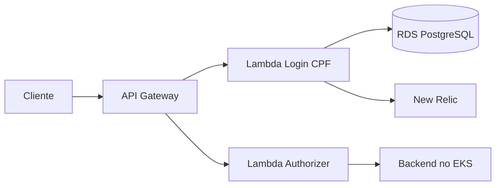

# Oficina Auth Serverless — Fase 3

Serviço serverless de autenticação por CPF da oficina mecânica. Implementa AWS Lambda Java 21, JWT RSA, Lambda Authorizer, API Gateway HTTP API e infraestrutura Terraform compatível com AWS Academy.

## Responsabilidades

- validar e normalizar CPF;
- consultar a existência e o status do cliente no RDS;
- emitir JWT de curta duração;
- autorizar rotas protegidas no API Gateway;
- produzir logs estruturados sem CPF ou token;
- provisionar os componentes serverless com a `LabRole` existente.

Não contém regras de Ordem de Serviço nem infraestrutura do EKS ou do RDS.

## Arquitetura



## Tecnologias

- AWS Lambda e API Gateway;
- Java 21;
- JWT com assinatura assimétrica;
- Terraform;
- GitHub Actions;
- New Relic Lambda integration.

## Build e testes

```bash
./mvnw -B verify spotless:check
```

O artefato usado pelas duas Lambdas é gerado em:

```text
target/oficina-auth.jar
```

## Terraform

O repositório cria a rota pública `POST /auth/cpf` e seis rotas do cliente protegidas pelo Lambda Authorizer. Configure um workspace HCP por ambiente, execute o build antes do plan e nunca versione chaves ou credenciais.

```bash
./mvnw -B -DskipTests package
terraform init -input=false
terraform plan -input=false -no-color
```

O `apply` permanece manual. Consulte [AWS Academy e deploy](docs/deployment.md) para as variáveis e a ordem segura de implantação.

## Documentação

- [Arquitetura e contratos](docs/architecture.md)
- [Segurança](docs/security.md)
- [AWS Academy e deploy](docs/deployment.md)
- [Repositórios da solução](docs/repositories.md)

## Contribuição

- mudanças somente por Pull Request;
- `main` representa produção;
- `homolog` representa homologação;
- CI aprovado antes do merge;
- nenhum CPF, token ou segredo em logs e arquivos versionados.
