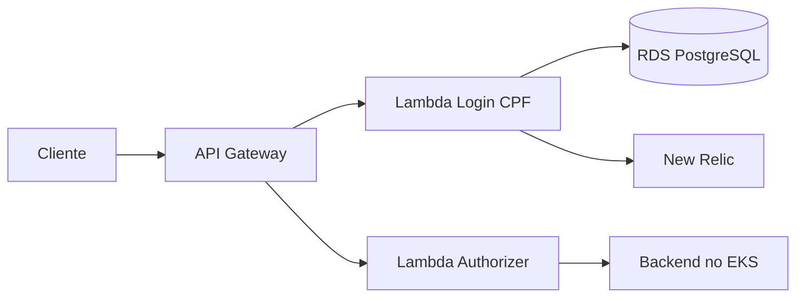

# Oficina Auth Serverless — Fase 3

Serviço de autenticação por CPF da oficina mecânica. Este repositório será responsável pela AWS Lambda, emissão de JWT, Lambda Authorizer e API Gateway.

## Responsabilidades

- validar e normalizar CPF;
- consultar a existência e o status do cliente no RDS;
- emitir JWT de curta duração;
- autorizar rotas protegidas no API Gateway;
- enviar logs, métricas e traces ao New Relic;
- provisionar e publicar os componentes serverless.

Não contém regras de Ordem de Serviço nem infraestrutura do EKS ou do RDS.

## Arquitetura

## Tecnologias planejadas

- AWS Lambda e API Gateway;
- Java 21;
- JWT com assinatura assimétrica;
- Terraform;
- GitHub Actions;
- New Relic Lambda integration.

## Desenvolvimento

A implementação será adicionada na etapa de autenticação da Fase 3. O contrato inicial e as decisões de segurança estão em `/docs`.

## Documentação

- [Arquitetura e contratos](docs/architecture.md)
- [Segurança](docs/security.md)
- [AWS Academy e deploy](docs/deployment.md)
- [Repositórios da solução](docs/repositories.md)

## Contribuição

- mudanças somente por Pull Request;
- `main` representa produção;
- `homolog` representa homologação;
- CI aprovado antes do merge;
- nenhum CPF, token ou segredo em logs e arquivos versionados.
