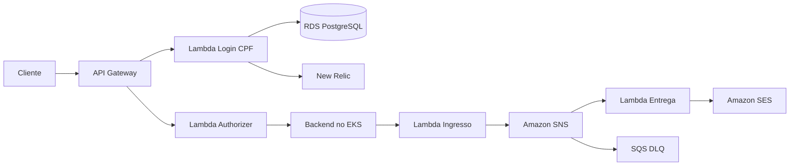

# Oficina Auth Serverless — Fase 3

Serviço serverless de autenticação por CPF e entrega assíncrona de notificações da oficina mecânica. Implementa AWS Lambda Java 21, JWT RSA, Lambda Authorizer, API Gateway HTTP API, SNS, SES e infraestrutura Terraform compatível com AWS Academy.

## Responsabilidades

- validar e normalizar CPF;
- consultar a existência e o status do cliente no RDS;
- emitir JWT de curta duração;
- autorizar rotas protegidas no API Gateway;
- produzir logs estruturados em JSON sem CPF ou token;
- expor telemetria opcional no New Relic e log de acesso técnico do API Gateway;
- aceitar notificações técnicas do backend e entregá-las de forma assíncrona por SNS e SES;
- redirecionar falhas definitivas de entrega para uma DLQ;
- provisionar os componentes serverless com a `LabRole` existente.

Não contém regras de Ordem de Serviço nem infraestrutura do EKS ou do RDS.

## Arquitetura



## Tecnologias

- AWS Lambda, API Gateway, SNS, SQS e SES;
- Java 21;
- JWT com assinatura assimétrica;
- Terraform;
- GitHub Actions;
- New Relic Lambda integration.

## Build e testes

```bash
./mvnw -B verify spotless:check
```

Os testes cobrem login com sucesso, CPF inválido, ausente, inexistente e inativo, JSON inválido, claims do JWT, token ausente, inválido, expirado, com emissor ou audiência incorretos, allow e deny do Authorizer, logs estruturados, encaminhamento de log de acesso e o fluxo assíncrono de notificações sem PII nos logs.

O artefato compartilhado pelas Lambdas é gerado em:

```text
target/oficina-auth.jar
```

## Terraform

O repositório cria a rota pública `POST /auth/cpf`, a rota técnica protegida `POST /internal/notifications` e seis rotas do cliente protegidas pelo Lambda Authorizer. Também cria o tópico SNS, a Lambda de entrega SES e a DLQ. Configure um workspace HCP por ambiente, execute o build antes do plan e nunca versione chaves ou credenciais.

```bash
./mvnw -B -DskipTests package
terraform init -input=false
terraform plan -input=false -no-color
```

Merges em `homolog` e `main` iniciam plan e apply automaticamente; o apply exige `TF_APPLY_ENABLED=true` e aprovação do GitHub Environment. `workflow_dispatch` permanece para reexecução controlada. Configuração ausente ou sessão AWS inválida falha explicitamente. Consulte [AWS Academy e deploy](docs/deployment.md).

## Observabilidade

A instrumentação New Relic e o encaminhamento do log de acesso são opcionais e desligados por padrão. Variáveis, ARNs de camada e consultas estão em [Observabilidade](docs/observability.md).

## Contrato

O contrato de autenticação, rotas protegidas e ingresso técnico de notificações está em [`docs/openapi/oficina-auth.yaml`](docs/openapi/oficina-auth.yaml) e pode ser importado diretamente na collection central do Postman.

## Documentação

- [Arquitetura e contratos](docs/architecture.md)
- [Observabilidade](docs/observability.md)
- [Contrato OpenAPI](docs/openapi/oficina-auth.yaml)
- [Segurança](docs/security.md)
- [AWS Academy e deploy](docs/deployment.md)
- [Repositórios da solução](docs/repositories.md)

## Contribuição

- mudanças somente por Pull Request;
- `main` representa produção;
- `homolog` representa homologação;
- CI aprovado antes do merge;
- nenhum CPF, token ou segredo em logs e arquivos versionados.
